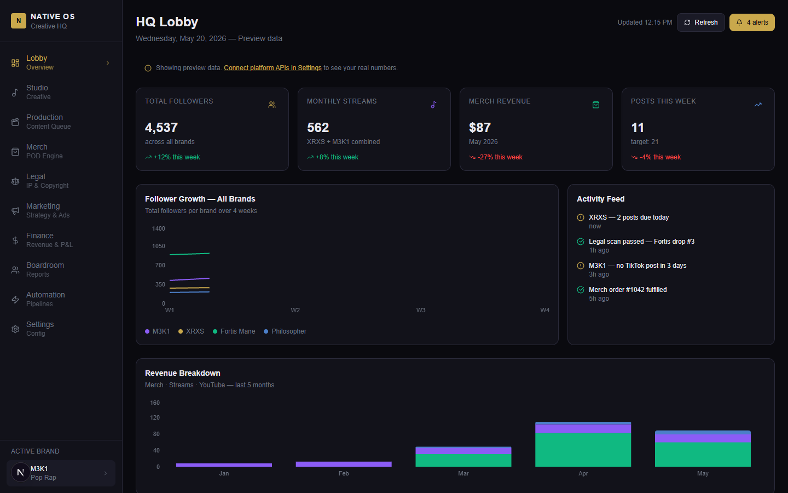
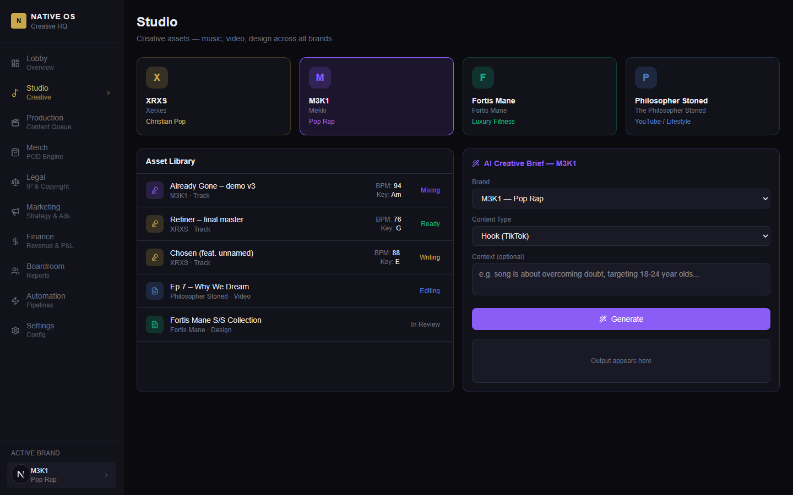
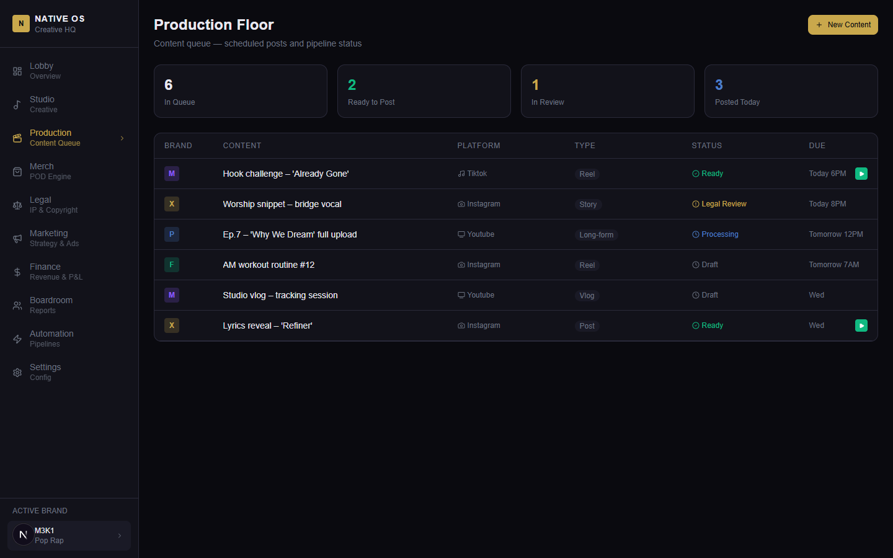
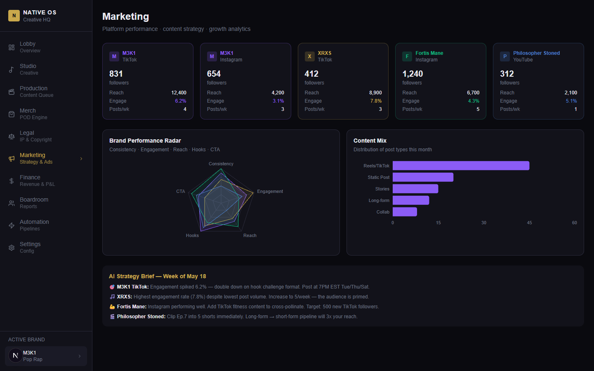
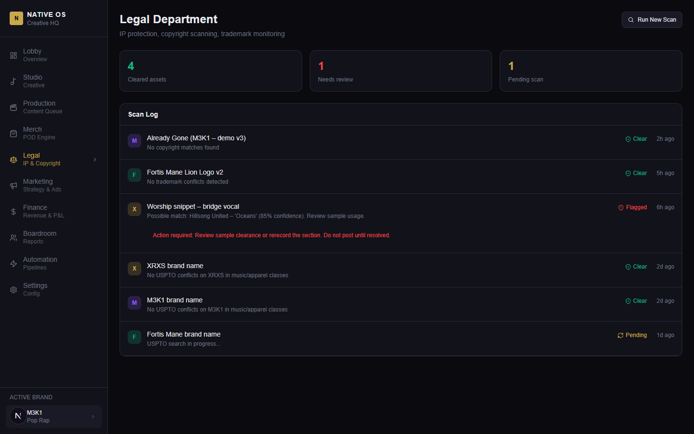
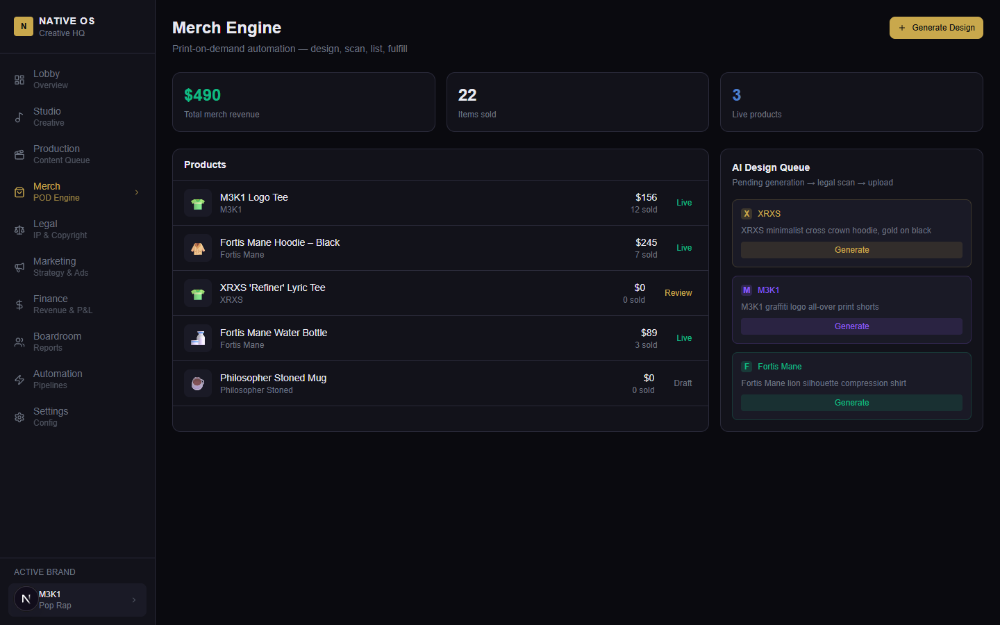
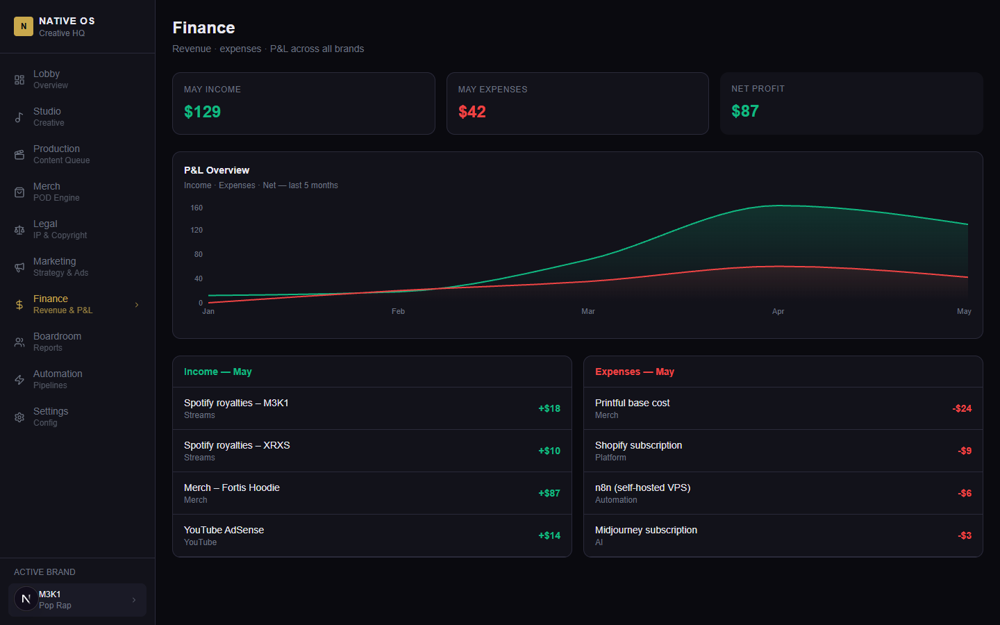
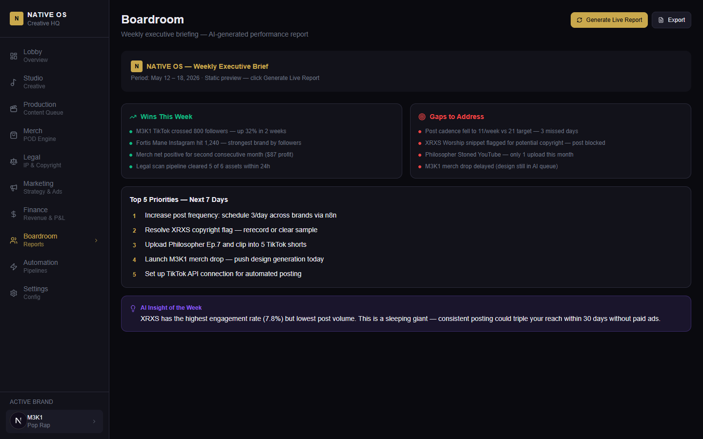
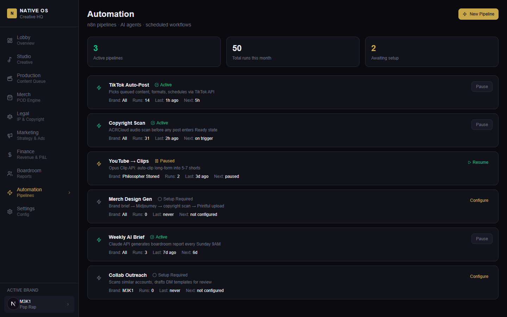
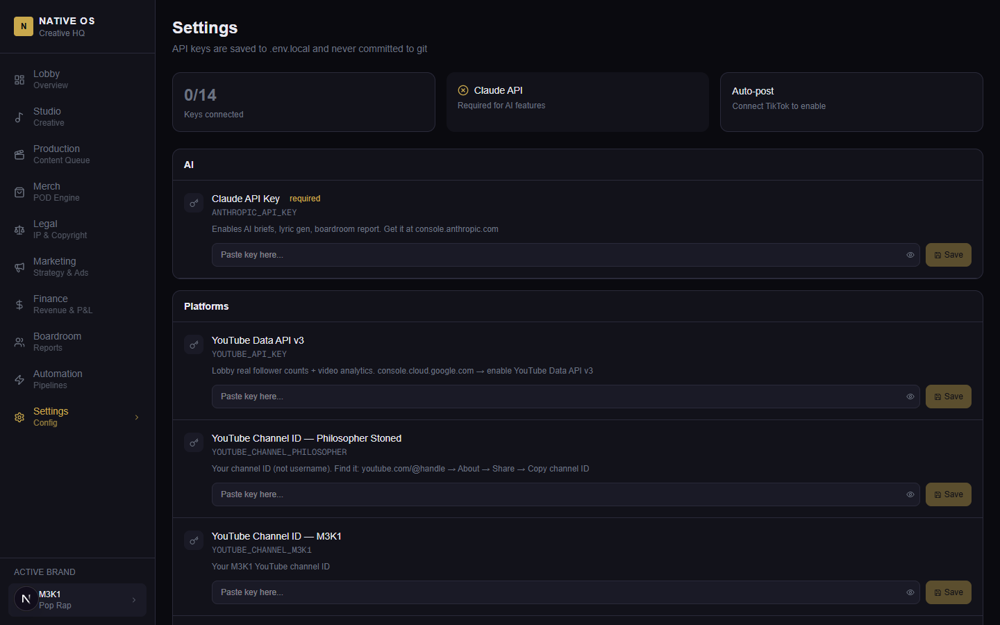

# NATIVE OS — Creative Enterprise HQ

> Your all-in-one operating system for building a multi-brand creative empire.

Native OS is a self-hosted dashboard that runs your entire creative business from one place — music releases, content pipelines, merch automation, legal protection, marketing analytics, and financial tracking across all your brands.

Built for independent creators who operate like a label, an agency, and a startup at the same time.

---

## The Brand Portfolio

| Brand | Genre | Platforms |
|---|---|---|
| **XRXS** (Xerxes) | Christian Pop | TikTok · Instagram · Spotify · Apple Music |
| **M3K1** (Mekki) | Pop Rap | TikTok · Instagram · YouTube · Spotify |
| **Fortis Mane** | Luxury Fitness | Instagram · TikTok · Shopify |
| **The Philosopher Stoned** | YouTube / Lifestyle | YouTube · Instagram |

---

## Screenshots

### HQ Lobby — Your command center
Real-time follower counts, revenue breakdown, growth charts, and activity feed across all four brands. Each brand card tracks progress to 100K followers.



---

### Studio — Creative asset management + AI generator
Track every track, video, and design across brands. The AI Creative Brief generator is powered by Claude — pick a brand, pick a content type (TikTok hook, verse lyrics, caption copy, merch prompt, video script), and get on-brand output in seconds.



---

### Production Floor — Content queue
Full content queue with status tracking (Draft → Legal Review → Ready → Posted). One-click publish when cleared.



---

### Marketing — Platform analytics + strategy
Per-platform follower counts, reach, and engagement rates. Brand performance radar chart, content mix breakdown, and a weekly AI strategy brief.



---

### Legal — IP & copyright protection
Every audio file, visual asset, and brand name scanned before it goes live. Powered by ACRCloud for music copyright detection. Flags are highlighted with action required notices — nothing slips through.



---

### Merch Engine — Print-on-demand automation
Live product tracking, sales and revenue per item, and an AI design idea queue. Generate Midjourney-ready prompts per brand, scan for IP conflicts, then push directly to Printful.



---

### Finance — Revenue and P&L
Income and expense tracking across streams, merch, and YouTube. Area chart P&L by month, broken down by source.



---

### Boardroom — AI executive briefing
Hit "Generate Live Report" and Claude analyzes your brand data in real time — wins, gaps, top 5 priorities for the week, and one key insight you probably haven't noticed.



---

### Automation — Pipeline registry
Track all n8n automation pipelines: TikTok auto-post, copyright scanning, YouTube → clip generation, merch design pipeline, weekly AI brief, collab outreach. Active/paused/needs-setup at a glance.



---

### Settings — API key management
Paste keys directly in the UI — they save to `.env.local` and never touch git. Grouped by category (AI, Platforms, Legal, Merch) with exact instructions for where to get each key.



---

## Tech Stack

| Layer | Tech |
|---|---|
| Framework | Next.js 16 (App Router, TypeScript) |
| Styling | Tailwind CSS |
| Charts | Recharts |
| AI | Claude API (claude-sonnet-4-6) |
| Platform APIs | YouTube Data v3, Spotify Web API, TikTok Business API, Instagram Graph API |
| Merch | Printful + Shopify |
| Copyright | ACRCloud |
| Caching | In-process (5-min TTL) |

---

## Getting Started

```bash
git clone https://github.com/john-fizer/native-os
cd native-os
npm install
npm run dev
```

Open [http://localhost:3000](http://localhost:3000).

---

## Connecting Real Data

Go to `/settings` and add your API keys. Start here for the fastest wins:

**1. Claude API** — `console.anthropic.com`
Unlocks the AI Brief Generator in Studio and the live Boardroom report.

**2. YouTube Data API v3** — `console.cloud.google.com`
Enable YouTube Data API v3, create an API key. Find your channel IDs: YouTube → About → Share → Copy channel ID.

**3. Spotify** — `developer.spotify.com`
Create an app, grab Client ID and Secret. Artist IDs are the last segment of any Spotify artist URL.

**4. TikTok Business API** — `developers.tiktok.com`
Requires business account verification. Apply, then use the OAuth flow.

**5. Instagram Graph API** — `developers.facebook.com`
Requires a Facebook Business account with an Instagram Professional account linked.

> All keys are stored in `.env.local` only — never committed to git.

---

## AI Features

The Studio generates brand-specific content using each brand's voice profile:

| Content Type | What it generates |
|---|---|
| Hook (TikTok) | 3 scroll-stopping hooks under 8 words each |
| Verse lyrics | Full verse with rhyme scheme, on-brand |
| Caption copy | 3 Instagram/TikTok captions with CTAs and hashtags |
| Merch prompt | 3 Midjourney-ready design prompts |
| Content script | Full 30-60s video script with timestamps |

The Boardroom generates a weekly executive brief: wins, gaps, top 5 priorities, and one key insight from Claude.

---

## Roadmap

- [ ] Content auto-scheduler (Production Floor → TikTok/Instagram auto-post)
- [ ] Merch design generator (AI prompt → Midjourney → ACRCloud → Printful → Shopify)
- [ ] Live platform data refresh on schedule
- [ ] Multi-user / team seats
- [ ] SaaS packaging (Stripe billing, white-label)

---

## License

MIT — build on it, give it to your people, or sell it.
