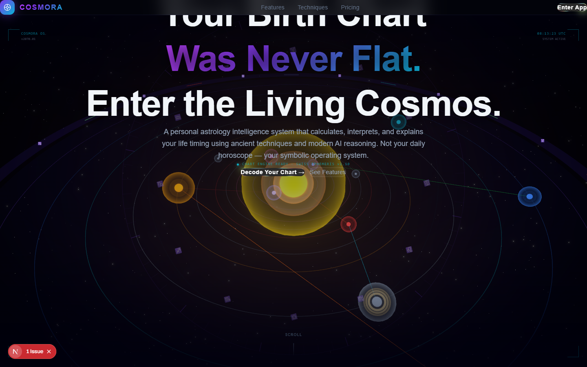
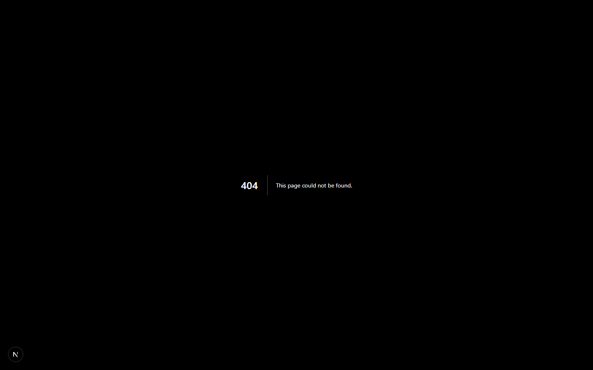

# NATIVE OS — Creative Enterprise HQ

> Your all-in-one operating system for building a multi-brand creative empire.

Native OS is a self-hosted dashboard that runs your entire creative business from one place — music releases, content pipelines, merch automation, legal protection, marketing analytics, and financial tracking across all your brands.

Built for independent creators who operate like a label, an agency, and a startup at the same time.

---

## The Brand Portfolio

| Brand | Genre | Platforms |
|---|---|---|
| **XRXS** (Xerxes) | Christian Pop | TikTok · Instagram · Spotify · Apple Music |
| **M3K1** (Mekki) | Pop Rap | TikTok · Instagram · YouTube · Spotify |
| **Fortis Mane** | Luxury Fitness | Instagram · TikTok · Shopify |
| **The Philosopher Stoned** | YouTube / Lifestyle | YouTube · Instagram |

---

## Screenshots

### Dashboard — Command center
Real-time follower counts, revenue breakdown, growth charts, and activity feed across all four brands.



---

### Marketing — AI Analysis
Hit "Run AI Analysis" and Claude audits your brand data live — top priority, per-brand action plans, content strategy, and growth lever.



---

### Automation — AI Agents + Pipelines
Live agent run monitoring with step-by-step traces. Launch the YouTube Research Agent, watch it work in real time, see every tool call it made.


---

### Content Queue
Full content queue with status tracking (Draft → Legal Review → Ready → Posted).


---

### Brand Profiles
Manage website, storefront, and social links for every brand in one place.


---

### Studio — Asset management
Track every track, video, and design. AI Creative Brief generator powered by Claude.


---

### Merch Engine
Live product tracking, AI design generation, push directly to Printful.


---

### Finance — P&L
Income and expense tracking across streams, merch, and YouTube.


---

## Tech Stack

| Layer | Tech |
|---|---|
| Framework | Next.js (App Router, TypeScript) |
| Database | Supabase (PostgreSQL + RLS) |
| Styling | Tailwind CSS — 12 visual themes |
| Charts | Recharts |
| AI | Claude API (claude-sonnet-4-6) + Tool Use |
| Agents | YouTube Research Agent, Thumbnail Pipeline |
| Platform APIs | YouTube Data v3, Spotify, TikTok, Instagram |
| Images | Ideogram API (thumbnails, merch) |
| Merch | Printful + Shopify |
| Copyright | ACRCloud |

---

## v2 Features

- **Supabase backend** — all data persisted in PostgreSQL
- **12 visual themes** — Native, JARVIS, Matrix, Cyberpunk, Cosmos, Alien, Synthwave, Bloodmoon, Win95, Noir, Arctic, Sleek
- **AI Marketing Brief** — Claude-powered live boardroom analysis
- **YouTube Research Agent** — agentic SEO intelligence (searches, stats, keyword research, content gaps)
- **SEO Thumbnail Pipeline** — research-informed CTR-optimized variants with Ideogram image generation
- **Live agent monitoring** — step-by-step traces for every agent run
- **Brand Profiles** — website, storefront, and social link management per brand

---

## Getting Started

```bash
git clone https://github.com/john-fizer/native-os
cd native-os
npm install
npm run dev
```

Open [http://localhost:3000](http://localhost:3000).

---

## Environment Variables

Create `.env.local` with:

```env
NEXT_PUBLIC_SUPABASE_URL=...
NEXT_PUBLIC_SUPABASE_ANON_KEY=...
SUPABASE_SERVICE_ROLE_KEY=...
ANTHROPIC_API_KEY=...
YOUTUBE_API_KEY=...
IDEOGRAM_API_KEY=...       # optional — enables AI thumbnail images
ELEVENLABS_API_KEY=...     # optional — voice generation
```

Run `supabase/schema.sql` in your Supabase SQL Editor to create all tables.

> All keys are stored in `.env.local` only — never committed to git.

---

## AI Agents

### YouTube Research Agent
Performs multi-step SEO research using the YouTube Data API:
1. Searches topic + related angles
2. Gets detailed stats on top performers
3. Researches keyword variations
4. Identifies content gaps and patterns

Returns: keywords with competition levels, title formulas, thumbnail patterns, recommended angle, SEO title, and content brief.

### Thumbnail Pipeline
Takes research output and generates 3 CTR-optimized thumbnail variants using 8 proven CTR formulas (Curiosity Gap, Shocking Stat, Before/After, Contrarian, etc.). Generates Ideogram images if configured.

---

## Roadmap

- [ ] Content auto-scheduler (queue → TikTok/Instagram auto-post)
- [ ] Live platform analytics sync
- [ ] Multi-user / team seats
- [ ] SaaS packaging (Stripe billing, white-label)

---

## License

MIT — build on it, give it to your people, or sell it.
